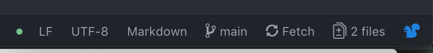

# Bardin lab Bioinformatics Training - Day 1

## Part I - Weclome to the Jungle

* [1. Getting set up](https://github.com/nriddiford/Bioinformatics_training#1-getting-set-up)
* [2. Command line basics](https://github.com/nriddiford/Bioinformatics_training#2-some-basic-command-line-navigation)
* [3. Getting code from Github](https://github.com/nriddiford/Bioinformatics_training#3-getting-code-from-github)

### 1. Getting set up

#### 1.1 Download & install R Studio
*  https://rstudio.com/products/rstudio/download/

#### 1.2 Download & install Atom
*  https://atom.io/download/mac
*  You'll also need to install the shell commands for atom. Either:
*  Run `apm install atom-shell-commands` from the command line
or
* Open Atom, select the Atom menu (left of `file`) and click `Install Shell Commands`

#### 1.3 Download & install iTerm2
*  https://iterm2.com
*  Make sure you pin this to your dock!

#### 1.4 Configure proxies
Open iTerm2 and copy and paste the following into the console:

```{bash}
env_file=''
if [ -f "~/.zshenv" ]
then
    env_file=~/.zshenv
else
    env_file=~/.bash_profile
fi

renv_file=~/.Renviron
touch $env_file $renv_file

if grep '#proxysetup' $env_file
then
    echo "Already configured proxies in $env_file"
else
    echo "Configuring proxies in $env_file"
    echo "#proxysetup
http_proxy=http://www-cache:3128
https_proxy=https://www-cache:3128
ftp_proxy=http://www-cache:3128
export http_proxy https_proxy ftp_proxy

echo \"
http_proxy=www-cache:3128
https_proxy=www-cache:3128
\" > $renv_file

function home() {
  unset http_proxy https_proxy ftp_proxy
  git config --global --unset http.proxy
  echo "" > $renv_file
  echo "Unsettiing proxies"
}

function work(){
    source $env_file
}" | cat - $env_file > .tempenv && mv .tempenv $env_file
fi

source $env_file
```

This sets up your computer so that you will be able to work with Rstudio and github from home or at the Curie (behind the proxy). If you are working from home, either use a VPN to connect to the Curie network, or run the command `home` to turn off your proxy, or `work` to turn it back on.

This is important as it will allow you to download and install libraries in R.

### 2. Some basic command line navigation

#### 2.1 Hello world
Now that you're set up to download files from behind the proxy, we can enter the world of the command line. Open iTerm2 and type the following and then press `return`:

```
echo "hello world"
```

This is you using the command line! When you run programs either on your laptop or on the cluster, this is where you do it.

Here are some great resources for command line navigation:
* [Terminal Cheat Sheet for Mac](https://github.com/0nn0/terminal-mac-cheatsheet#english-version) - handy guide in multiple languages!

#### 2.2 Navigation
One of things you'll need to get comfortable with is navigating your computer by using the command line. To run any command/script type something in, and then press `return`. Fist, let's see where we are.

Type `pwd` to see your current location. We're going to be downloading some folders ('directories') from Github, so let's navigate to a sensible place. Run the following commands, line by line:


Navigate to your 'home' (`~`) directory using the 'change directory' command (`cd`):

```
cd ~
```

Let's move to our desktop:
```
cd Desktop/
```

We could have also done:
```
cd ~/Desktop
```

Check where we are by printing the woring directory (`pwd`):
```
pwd
```

Now we want to use the 'make directory' command (`mkdir`) that will contain all the folders and files we're going to be working with. You can choose your own name, or use:

```
mkdir Bioinformatics
```

Now let's move ourselves into this directory:
```
cd Bioinformatics/
```

Note that this only works from the Desktop. We can type the following to get here from anywhere on our computer:
```
cd ~/Desktop/Bioinformatics
```

**When you're typing commands, you can press tab at anytime to autocomplete the command (much quicker!)**

Check where we are:
```
pwd
```

Make a text (`.txt`) file
```
touch welcome.txt
```

Open this in Atom
```
atom welcome.txt
```

Atom is a text editor where you can write code, text or lyrics to songs that are stuck in your head for some reason. Let's fill this file with some catchy '80s rock:

```
Welcome to the jungle
Weve got fun n games
We got everything you want
Honey, we know the names
We are the people that can find
Whatever you may need
If you got the money, honey
We got your disease
```

... and save the file


#### 2.3 Command line essentials
Just to get you a bit more familiar with using some common commands, let's mess around with this file a bit. Run the following commands, line by line:

Make sure we're in the right place
```
cd ~/Desktop/Bioinformatics
```

Preview the file using the `more` command:
```
more welcome.txt
```

Preview the file using the `less` command (`q` to exit):
```
less welcome.txt
```

Preview the first 10 lines of the file using the `head` command:
```
head welcome.txt
```

Preview the first 3 lines of the file using the `head` command with options:
```
head -n 3 welcome.txt
```

This is an example of running a command with an argumnent (an option). You'll do this a lot! `head` is a program that someone's written to do a very speciic thing. Let's see what that is by viewing the manual (`man`):
```
man head
```

This tells us that the `-n` is an argument that specifies how many lines to show, so `head -n 3 welcome.txt` will give us the first 3 lines of `welcome.txt`.

Press `q` to exit the manual.

Now let's see how many lines are in `welcome.txt` using `wc -l`:
```
wc -l welcome.txt
```

Now, let's use a `pipe` (`|`, on French keyboards this is `option` + `shift` + `l`), to send the output from our `head` command to the `wc` command:
```
head -n 3 welcome.txt | wc -l
```

This is a really handy way of 'chaining together' commands, without having to run them one by one. Instead, we could have done:
```
head -n 3 welcome.txt > three_lines.txt
wc -l three_lines.txt
```

Here the `>` directs the output from `head` into a new file `three_lines.txt`.

**Note: It's REALLY important that file names (and directories) DO NOT contain spaces, or quotation marks or any other punctuation. One convention is to separate words using '_'**

Let's chck that we've created a file by listing (`ls`) the contents of the current working directory:
```
ls
```

We can also use some arguments to make this a bit easier to read:
```
ls -lh
```

You can see what these arguments are doing by cheking out the manual for `ls`
```
man ls
```

Now, rather than making a new file, let's append (`>>`) something to the `three_lines.txt` file:
```
head -n 2 welcome.txt >> three_lines.txt
```

Let's see what we end up with:
```
ls -lh
more three_lines.txt
```

Now we have a file that contains the original 3 lines (from `head -n 3`) plus two new lines that we've appended using `head -n 2`. We should rename this file by moving (`mv`) the moving the file to a different location! Let's rename it `five_lines.txt`

```
mv three_lines.txt five_lines.txt
ls -lh
```

Now let's copy the contents of this file to a new file called `five_lines_2.txt`
```
cp five_lines.txt five_lines_2.txt
```

To finish up, let's go a search in `five_lines.txt` for a particular word, `everything` using the `grep` command:
```
grep "everything" five_lines.txt
```

This is also useful to search for the same word, or combination (`string`) of words in mutliple files. Let's look for `everything` in all of our `.txt` files:
```
grep "everything" *.txt
```

The `*` here serves as a wildcard, that will look for all files ending in `.txt`

Maybe we want to count the number of times we find a certain `string`, like `jungle`. We can use the count (`-c`) argument in grep to do this:
```
grep -c "jungle" *.txt
```

Finally, let's try something a bit crazy. Let's use this `*` to run a command that will concatenate (`cat`) all `.txt` files in the current directory. We can then pipe this output to grep, where we can search for the string `jungle` using the argument `-o`. Finially, we'll pipe this output to another command `sed`, and subsititue all occurances of `j` with `b`, and then save this to a file called `bungles.txt`:

```
cat *.txt | grep -o "jungle" | sed 's/j/b/g' > bungles.txt
```

Have a quick look at `bungles.txt` and see if contains what you expected!
```
less bungles.txt
```

To clean up, let's remove (`rm`) all files that whose **name** contains the string `lines` and have the extension `.txt` using the `expression` `*lines*.txt`. This translates "find files whose name contains `lines`, which can be followed or preceeded by anything (`*`) but ends in `.txt`"

**Be careful with `rm` - there's no `trash` on the command line. Once a file's deleted, it's deleted.**

```
rm *lines*.txt
```

### 3. Getting code from Github

#### 3.1 Get code from github

Have a look at one of repositories on Github: https://github.com/nriddiford/alleleFreqs

Github is a place where we can store code-based projects, and track changes as they're made. This particular repository contains a few scripts that all involve working with allele frequencies. Click on the folder `script` to see some of the code, and click again on `alleleFreqs.R`. This code is written in `R` (`.R`), and we're going to use it in the next step to plot some varscan data.

Open iTerm2 and type the following:

```
cd ~/Desktop/Bioinformatics
git clone https://github.com/nriddiford/Bioinformatics_training.git
```

This downloads everything in this repository into a directory of the same name on your local machine.
Now, let's clone another repository `alleleFreqs`:

```
git clone https://github.com/nriddiford/alleleFreqs.git
```

Now open the `Bioinformatics` directory in atom. Opening a directory like this will give you a nice overview of the sort of files we have in our project. On the command line we use `.` as a shortcut indicate the `current working directory`:

```
atom .
```

Here, you should see the files that we created earlier, and two directories that we've just cloned `Bioinformatics_training` and `alleleFreqs`.

#### 3.2 Update a repository

If the code in a Github repository is changed - maybe to fix a bug or to add a new feature - if will now be different to the repository that you've just cloned. To get `pull` any changes made in `Bioinformatics_training` and incorporate them into your clone, run:

```
cd Bioinformatics_training
git pull
```

Note that `Bioinformatics_training` and `alleleFreqs` are separate repositories, so to update both you'll need to perform the same action in each repository.

#### 3.3 Using git commands in Atom
One of the nice things about using something like Atom, is that it makes working with Github projects really easy. As we did before, let's open the whole directory `Bioinformatics_training`:

```
cd ~/Desktop/Bioinformatics/Bioinformatics_training
atom .
```

In the bottom right hand corner, you should see a toolbar that looks like this:



Here, Atom has realised that we are in a Github repository, and gives us some tools to run common git commands with Atom itself. To get the latest chages, click `Fetch` (not *exactly* analagous to `git pull`, but for the moment it's fine to assume that it's doing the same thing). To do a `git pull`, right click on the `Fetch` icon, and select `pull`.


#### 3.4 Raise an issue on Github
